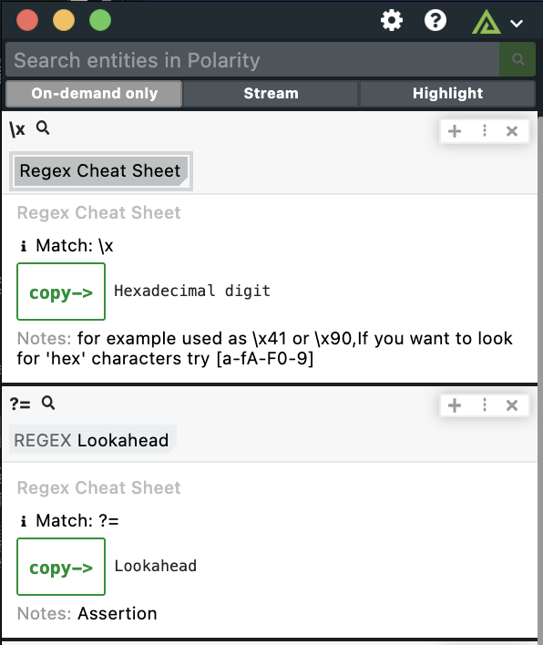

# Polarity Regex Cheat Sheet Integration

|  |
|---|
|*Regex Cheat Sheets*|

The Polarity Regex Cheat Sheet integration looks up regex characters to let users know what those characters for and notes about them.  This is an On-Demand only integration.

## Installation Instructions

Installation instructions for integrations are provided on the [PolarityIO GitHub Page](https://polarityio.github.io/).

## Polarity

Polarity is a memory-augmentation platform that improves and accelerates analyst decision making.  For more information about the Polarity platform please see:

https://polarity.io/
